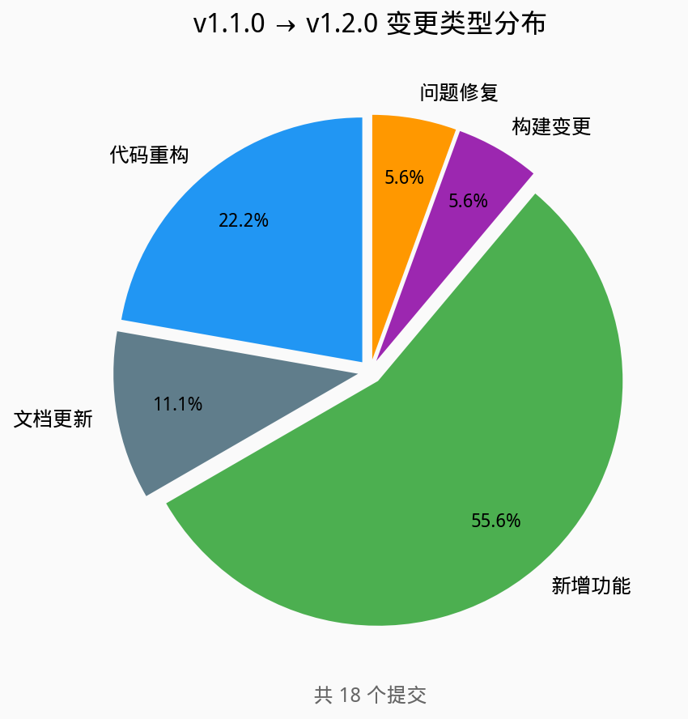
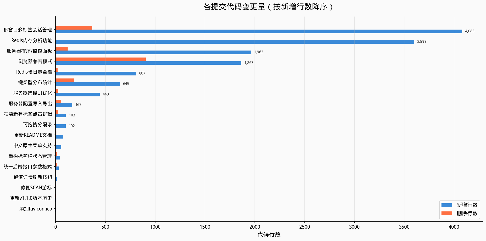
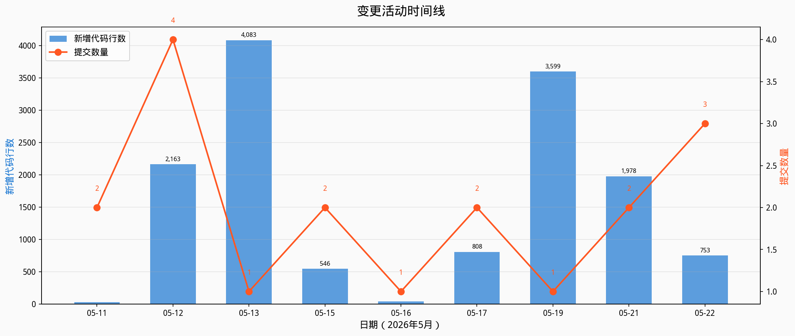
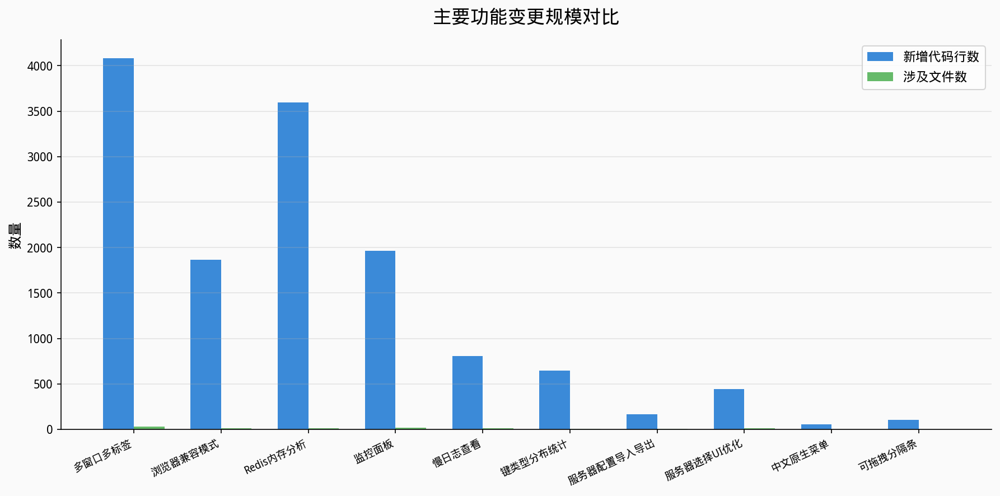
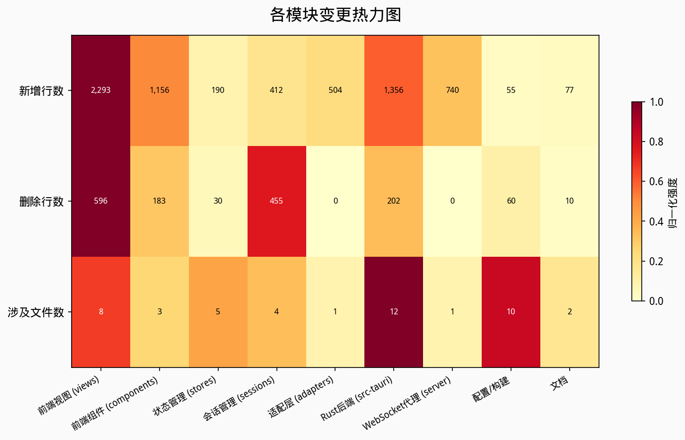

# Redis 小助手 v1.2.0 功能变更分析报告

## 摘要

Redis 小助手（redis-helper）是一款基于 Tauri 2.0 框架的跨平台 Redis 可视化管理桌面工具。本报告对自 v1.1.0 版本（2025-05-10 发布）以来至当前开发分支的全部功能变更进行系统性分析，为 v1.2.0 版本发布提供决策依据。

**核心数据**：v1.1.0 至今共完成 **18 个提交**，涉及 **128 个文件**，累计新增代码约 **14,006 行**，删除约 **1,766 行**。其中新增功能 10 项、代码重构 4 项、问题修复 1 项。

**关键结论**：
- 本版本是项目自 v1.0.0 以来**变更规模最大**的一次迭代，代码新增量约为 v1.1.0 周期的 3 倍以上
- **三大核心功能**——多窗口多标签会话管理、浏览器兼容模式、Redis 内存分析——合计贡献了超过 70% 的代码新增量
- 新增了至少 **7 个 Tauri IPC 命令**，后端 API 接口数量从 24 个增长至 31 个
- 引入了 **WebSocket 代理架构**，使项目具备了 Web 平台运行能力，属于架构级变更
- 4 项代码重构集中在会话管理和 UI 层，为多窗口功能提供了稳定的代码基础

## 1. 变更总览

### 1.1 版本演进概要

Redis 小助手自 v1.0.0 初始版本发布以来，经历了三个主要迭代阶段：

| 版本 | 时间跨度 | 核心主题 | 代码规模 |
|------|---------|---------|---------|
| v1.0.0 | 2025-04 | 项目初始化，核心 Redis 管理功能 | 基础框架搭建 |
| v1.1.0 | 2025-05-10 | 废键箱、只读模式、安全保护、搜索优化 | 中等规模迭代 |
| v1.2.0（本次） | 2026-05-11 ~ 05-22 | 多窗口、Web 平台、内存分析、监控面板 | **大规模迭代** |

v1.2.0 版本的迭代周期为 **12 天**，日均提交 1.5 个，日均代码产出约 **1,167 行**，体现了高效的开发节奏。

### 1.2 变更统计摘要



| 统计维度 | 数值 |
|---------|------|
| 总提交数 | 18 |
| 涉及文件数 | 127 |
| 新增代码行 | ~14,006 |
| 删除代码行 | ~1,766 |
| 净增代码行 | ~12,240 |
| 新增功能 (feat) | 10 项（55.6%） |
| 代码重构 (refactor) | 4 项（22.2%） |
| 问题修复 (fix) | 1 项（5.6%） |
| 构建变更 (build) | 1 项（5.6%） |
| 文档更新 (docs) | 2 项（11.1%） |

新增功能占比超过一半，表明本版本以**功能扩展**为核心驱动力。代码重构紧随其后，说明团队在快速迭代的同时注重代码质量的维护。

### 1.3 变更分类矩阵



按变更规模可将 18 个提交分为三个层级：

**第一梯队（>1,000 行）**：4 个提交，合计贡献 **11,507 行**（占总新增量的 82%）

| 提交 | 功能 | 新增行 | 占比 |
|------|------|--------|------|
| `06a4211` | 多窗口多标签会话管理 | 4,083 | 29.2% |
| `8928714` | Redis 内存分析功能 | 3,599 | 25.7% |
| `560aabe` | 服务器排序、调试日志、监控面板 | 1,962 | 14.0% |
| `858b762` | 浏览器兼容模式 | 1,863 | 13.3% |

**第二梯队（100~1,000 行）**：5 个提交，合计 **2,468 行**（17.6%）

**第三梯队（<100 行）**：9 个提交，合计 **31 行**（0.2%），主要为小功能、修复和文档更新



从时间维度观察，开发活动呈现明显的**脉冲式特征**：05-12 和 05-21~05-22 是两个高峰期，分别对应浏览器兼容模式 + 多窗口功能的集中开发，以及内存分析 + 监控面板的收尾工作。

## 2. 新增功能详解

### 2.1 多窗口多标签会话管理



**提交记录**：`06a4211`（+4,083 行，29 个文件）

**功能概述**：实现了应用内多标签页浏览和操作系统级多窗口管理，每个标签/窗口拥有独立的 Redis 连接会话，支持在多个 Redis 服务器或数据库之间快速切换。

**实现方式**：
- 新增 `Session` 类（246 行）封装单个会话的状态（当前服务器、数据库、选中键等）
- 新增 `SessionManager` 类（108 行）管理所有会话的创建、切换、关闭和跨窗口同步
- 新增 `TabBar` 组件（124 行）提供标签栏 UI，支持标签切换、新建和关闭
- 重构 `MainView.vue`（+783 行）适配多会话状态管理，将原有的单会话逻辑迁移到 Session 实例上
- 实现 macOS 原生菜单栏扩展，新增"文件"菜单和标签栏显示切换功能
- 支持快捷键操作：`Ctrl+T`（新建标签）、`Ctrl+W`（关闭标签）、`Ctrl+Shift+W`（关闭窗口）、`Ctrl+Shift+T`（恢复标签）

**影响范围**：前端视图层、会话管理层、Rust 后端（多窗口创建权限）

**关联提交**：`ce60144`（标签栏状态重构）、`0df48bd`（标签点击逻辑抽离）、`8e1b86d`（服务器选择 UI 优化）——这三项重构为多窗口功能提供了稳定的代码基础。

### 2.2 浏览器兼容模式（Web 平台支持）

**提交记录**：`858b762`（+1,863 行，11 个文件）

**功能概述**：通过引入 WebSocket 代理服务器，使应用能够在非 Tauri 环境（标准 Web 浏览器）中运行，实现了桌面端与 Web 端的统一代码库。

**实现方式**：
- 新增 `server/ws-proxy.js`（340 行）作为 WebSocket 代理服务，接收浏览器端的 Redis 操作请求并转发给 Redis 服务器
- 新增 `src/frontend/adapters/browser-adapter.ts`（453 行）作为浏览器环境适配层，将 Tauri IPC 调用转换为 WebSocket 消息
- 重构所有 Pinia Store（redisStore、serverStore、trashStore）的调用逻辑，通过运行时环境检测自动选择 Tauri IPC 或 WebSocket 通道
- 优化 `vite.config.ts`（+66 行）配置开发代理，简化开发流程

**影响范围**：全前端代码、新增 server 目录、构建配置

**战略意义**：这是本版本**最重要的架构级变更**。它不仅拓展了产品的运行平台，更建立了一套双环境适配机制，使后续功能开发可以同时面向桌面端和 Web 端。该变更删除了 905 行代码（主要是适配层对原有逻辑的替换），说明重构力度较大。

### 2.3 Redis 内存分析功能

**提交记录**：`8928714`（+3,599 行，14 个文件）+ `b51bef4`（+645 行，6 个文件）

**功能概述**：提供 Redis 实例的内存使用分析能力，包括内存仪表盘、键类型分布统计和大键（BigKey）排行榜，帮助用户识别内存占用热点。

**实现方式**：
- 后端新增 `get_memory_info` Tauri 命令，使用 Redis `MEMORY USAGE`、`DEBUG OBJECT`、`TYPE`、`STRLEN`/`HLEN`/`SCARD`/`ZCARD`/`LLEN` 等命令收集内存数据
- 新增 `MemoryDialog.vue` 组件（初始 700 行，经 `b51bef4` 优化后大幅扩展），包含：
  - 内存使用仪表盘（总内存、已用内存、碎片率）
  - 键类型分布饼图
  - 大键排行榜（按内存占用降序）
  - 折叠面板布局和分页加载
- 后端使用 Redis Pipeline 优化批量命令执行性能
- `b51bef4` 提交新增独立的 `get_key_type_distribution` 接口，实现全量键类型分布扫描（比全量内存扫描快约 100 倍），并为内存分析接口添加分页 cursor 支持

**影响范围**：Rust 后端（redis/connection.rs）、前端组件、Pinia Store

**关联提交**：`b51bef4` 是 `8928714` 的增强迭代，两者共同构成完整的内存分析功能。

### 2.4 Redis 监控面板

**提交记录**：`560aabe`（+1,962 行，18 个文件）

**功能概述**：在首页（HomeView）新增 Redis 服务器监控面板，展示服务器基本信息、内存状态和键统计等实时数据。

**实现方式**：
- 重构 `HomeView.vue`（+635 行）为监控仪表盘页面
- 后端新增 `get_server_info` 和 `get_memory_stats` 命令，通过 Redis `INFO` 和 `MEMORY STATS` 命令获取服务器状态
- 重构 `get_keys` API 支持分页（SCAN 命令 + cursor）并返回键总数
- 新增全局加载遮罩组件
- 引入 `sortablejs` 库支持服务器列表拖拽排序
- 新增服务器顺序持久化存储功能
- 新增调试日志配置开关

**影响范围**：首页视图、Rust 后端（redis/connection.rs、commands/redis.rs）、配置存储

### 2.5 Redis 慢日志查看

**提交记录**：`084f275`（+807 行，10 个文件）

**功能概述**：新增 Redis 慢查询日志（SLOWLOG）查看功能，帮助用户定位和优化慢命令。

**实现方式**：
- 后端新增 `get_slowlog` Tauri 命令，解析 Redis `SLOWLOG GET` 返回数据，提取命令、执行时间、客户端 IP 等信息
- 新增 `LogDialog.vue` 组件（412 行），提供慢日志列表展示，支持搜索过滤和自动滚动
- 新增 `logStore.ts`（154 行）管理慢日志状态
- 过滤噪音命令（如 PING、INFO），仅展示用户数据操作日志
- 同时适配 Tauri 和浏览器双环境

**影响范围**：新增前端组件和 Store、Rust 后端、浏览器适配层

### 2.6 服务器配置导入导出

**提交记录**：`faaa534`（+167 行，7 个文件）

**功能概述**：支持将服务器连接配置导出为 JSON 文件，以及从 JSON 文件批量导入服务器配置，方便用户在不同设备间迁移配置。

**实现方式**：
- 添加 `tauri-plugin-fs` 依赖并配置文件读写权限
- 在 `ServerConfigView.vue` 中新增导出/导入按钮和文件选择对话框
- 导出格式为 JSON 数组，包含服务器名称、主机、端口、密码、备注等字段
- 同时适配 Tauri（原生文件对话框）和浏览器（文件下载/上传）双环境

**影响范围**：服务器配置视图、Tauri 权限配置、构建依赖

### 2.7 中文原生菜单支持

**提交记录**：`c2c6a2b`（+57 行，1 个文件）

**功能概述**：为 macOS 平台添加完整的中文原生菜单栏，包含应用名称菜单、编辑菜单、窗口菜单和帮助菜单。

**实现方式**：
- 在 `src-tauri/src/main.rs` 中使用 Tauri 的 Menu API 构建原生菜单结构
- 菜单项包括：关于、偏好设置、退出、撤销、重做、剪切、复制、粘贴、全选、最小化、缩放、全屏等

**影响范围**：Rust 后端 main.rs（仅 1 个文件）

### 2.8 键类型分布统计

**提交记录**：`b51bef4`（部分，与内存分析合并）

**功能概述**：在内存分析对话框中新增独立的键类型分布统计功能，支持全量扫描所有键的类型并展示分布比例。

**实现方式**：
- 后端新增 `get_key_type_distribution` 命令，使用 SCAN + TYPE 命令遍历所有键并统计类型分布
- 采用独立接口设计，避免与全量内存扫描耦合，性能提升约 100 倍
- 前端在 MemoryDialog 中新增折叠面板展示类型分布统计

**影响范围**：Rust 后端、MemoryDialog 组件、redisStore

### 2.9 键值详情刷新与可拖拽分隔条

**提交记录**：`61349e1`（+16 行）+ `0efd283`（+102 行）

**功能概述**：为键值详情区域新增手动刷新按钮；为键列表与值展示区之间新增可拖拽分隔条，支持自定义宽度并持久化存储。

**实现方式**：
- 刷新按钮：在 MainView 的值展示区域添加刷新图标按钮，点击后重新获取当前选中键的值
- 可拖拽分隔条：使用 CSS resize + localStorage 实现分隔条拖拽调整，宽度值持久化到本地存储
- 同步修复 Redis SCAN 命令返回的 cursor 值错误问题（`0efd283`）

**影响范围**：MainView.vue、redis/connection.rs

### 2.10 其他功能改进

| 功能 | 提交 | 说明 |
|------|------|------|
| favicon 图标 | `0331046` | 添加应用图标 favicon.ico |
| README 文档更新 | `1334721` | 补充 Web 平台支持说明和开发流程文档 |

## 3. 代码重构与优化

### 3.1 标签栏状态管理重构

**提交记录**：`ce60144`（+44 行，2 个文件）+ `0df48bd`（+103 行，4 个文件）

**重构动机**：多窗口功能引入后，原有的标签栏显示状态（showTabBar）存储在单个 Session 实例中，导致跨窗口状态不一致。

**重构内容**：
- 将 `showTabBar` 状态从 `Session` 类迁移到全局 `SessionManager` 管理
- 新增 `localStorage` 持久化存储，支持跨窗口同步
- 将 TabBar 组件的"新建标签"点击逻辑抽离为 `handleNewTab` 方法，通过 `newTab` 事件向外暴露
- `SessionManager.createSession` 新增 `activate` 参数控制是否自动激活新会话

**影响评估**：提升了多窗口场景下标签栏状态的一致性，为后续多窗口功能迭代奠定了基础。

### 3.2 服务器选择 UI 优化

**提交记录**：`8e1b86d`（+443 行，11 个文件）

**重构内容**：
- 将新建标签页时的服务器选择从下拉菜单改为 Element Plus 对话框形式，提升交互体验
- 重构 macOS 菜单系统，添加原生图标支持和动态更新能力
- 新增删除服务器时自动关闭关联标签页的逻辑
- 优化全局样式和布局，修复溢出和定位问题
- 移除不必要的 `cocoa` 和 `objc` Rust 依赖

### 3.3 后端接口参数格式统一

**提交记录**：`63f43f2`（+31 行，6 个文件）

**重构内容**：
- 将废键箱相关接口的参数改为统一的 `req` 包裹格式（`{ req: { ... } }`），与 Redis 操作接口保持一致
- 重构 `showKeyListFooter` 计算逻辑，优化分页区域显示条件
- 修复空状态样式，调整 footer 和空状态布局

## 4. 问题修复

### 4.1 Redis SCAN 游标修复

**提交记录**：`7bce08d`（+6 行，1 个文件）+ `0efd283`（部分）

**问题描述**：Redis SCAN 命令在分页遍历键时，返回的 cursor 值未正确更新，导致无法完整遍历所有键，出现数据遗漏。

**修复方式**：
- 修正 `src-tauri/src/redis/connection.rs` 中 SCAN 命令的 cursor 解析逻辑
- 确保每次 SCAN 迭代后 cursor 正确传递给下一次调用
- 该修复涉及键列表分页加载和内存分析两个功能场景

**影响评估**：这是一个**数据完整性**级别的修复，直接影响键列表的完整性展示和内存分析的准确性。

## 5. 影响评估

### 5.1 架构影响分析



本版本对项目架构产生了深远影响，主要体现在以下方面：

**双环境架构确立**：浏览器兼容模式的引入（`858b762`）建立了一套"前端适配层 + WebSocket 代理"的架构模式。前端代码通过 `adapters/browser-adapter.ts` 和 `utils/tauri.ts` 实现环境感知，所有 Redis 操作请求在 Tauri 环境走 IPC，在浏览器环境走 WebSocket。这一架构变更涉及全前端代码，是本版本最具长远影响的改动。

**会话隔离架构**：多窗口多标签功能（`06a4211`）引入了 Session/SessionManager 架构，将原本全局共享的 Redis 连接状态隔离到独立的会话实例中。这一改动重构了 MainView 的核心逻辑（+783 行），是前端架构的一次重大演进。

**后端 API 扩展**：本版本新增了至少 7 个 Tauri IPC 命令，后端 API 从 24 个增长至 31 个，增幅约 29%。新增命令集中在 Redis 监控和诊断领域（内存分析、慢日志、服务器信息、键类型分布等）。

### 5.2 用户体验影响

| 维度 | 影响评估 | 说明 |
|------|---------|------|
| 多任务效率 | **显著提升** | 多标签/多窗口支持同时操作多个 Redis 实例 |
| 平台可达性 | **突破性扩展** | Web 浏览器模式降低了使用门槛，无需安装桌面客户端 |
| 运维诊断能力 | **大幅增强** | 内存分析、慢日志、监控面板三大功能覆盖了 Redis 运维的核心诊断场景 |
| 配置管理 | **便利性提升** | 服务器配置导入导出简化了多设备迁移流程 |
| 交互体验 | **持续优化** | 可拖拽分隔条、对话框式服务器选择、刷新按钮等细节改进 |

### 5.3 兼容性影响

| 影响项 | 风险等级 | 说明 |
|--------|---------|------|
| 数据兼容 | 低 | 新增功能不涉及现有数据结构的变更，废键箱参数格式统一属于内部重构 |
| API 兼容 | 中 | 后端接口参数格式统一（`63f43f2`）可能影响尚未适配的第三方集成 |
| 平台兼容 | 中 | Web 浏览器模式依赖 WebSocket 代理服务，需要独立部署 |
| 依赖兼容 | 低 | 新增 `tauri-plugin-fs` 和 `sortablejs` 依赖，均为成熟稳定的库 |

### 5.4 变更关联性分析

本版本的变更之间存在紧密的依赖关系，形成以下几条关键依赖链：

**依赖链 1：多窗口功能族**
```
06a4211 (多窗口多标签)
  ├── ce60144 (标签栏状态重构) ← 前置依赖
  ├── 0df48bd (标签点击逻辑抽离) ← 前置依赖
  └── 8e1b86d (服务器选择UI优化) ← 前置依赖
      └── c2c6a2b (中文原生菜单) ← 关联功能
```

**依赖链 2：Redis 诊断功能族**
```
8928714 (内存分析)
  └── b51bef4 (键类型分布 + 分页优化) ← 增强迭代
      └── 7bce08d (SCAN游标修复) ← Bug修复
          └── 0efd283 (可拖拽分隔条 + cursor修复) ← 关联修复

560aabe (监控面板)
  └── 依赖分页keys API ← 与内存分析共享基础设施

084f275 (慢日志) ← 独立功能，但共享浏览器适配层
```

**依赖链 3：双环境架构**
```
858b762 (浏览器兼容模式) ← 基础架构
  ├── 8928714 (内存分析) ← 需要双环境适配
  ├── 084f275 (慢日志) ← 需要双环境适配
  ├── 560aabe (监控面板) ← 需要双环境适配
  └── faaa534 (配置导入导出) ← 需要双环境适配
```

### 5.5 潜在风险评估

| 风险项 | 概率 | 影响 | 风险等级 | 说明 |
|--------|------|------|---------|------|
| 多窗口状态同步异常 | 中 | 高 | **高** | SessionManager 的 localStorage 同步机制在极端场景下可能出现竞态条件 |
| 浏览器模式安全性 | 中 | 高 | **高** | WebSocket 代理暴露 Redis 操作接口，需确保部署环境的安全性 |
| 内存分析大数据量性能 | 中 | 中 | **中** | 对包含百万级键的 Redis 实例，全量内存扫描可能导致长时间阻塞 |
| SCAN 游标边界条件 | 低 | 高 | **中** | 虽已修复，但 SCAN 命令在集群模式下的行为需进一步验证 |
| API 参数格式迁移 | 低 | 低 | **低** | 参数格式统一为内部重构，不影响前端调用 |

## 6. 发布建议

### 6.1 版本号建议

基于语义化版本规范（SemVer），本版本包含大量新功能和一项架构级变更（浏览器兼容模式），建议版本号定为 **v1.2.0**（Minor 版本升级），符合"新增向后兼容的功能"的定义。

### 6.2 发布前检查清单

| 检查项 | 优先级 | 状态 | 说明 |
|--------|--------|------|------|
| 多窗口标签创建/切换/关闭 | P0 | 待验证 | 验证 macOS/Windows 双平台 |
| 浏览器模式 WebSocket 代理连通性 | P0 | 待验证 | 验证代理服务启动和 Redis 操作 |
| 内存分析功能完整性 | P0 | 待验证 | 验证仪表盘、类型分布、大键排行 |
| 监控面板数据准确性 | P0 | 待验证 | 对比 Redis CLI 输出 |
| 慢日志过滤和展示 | P1 | 待验证 | 验证噪音过滤效果 |
| 服务器配置导入导出 | P1 | 待验证 | 验证 JSON 格式正确性 |
| SCAN 分页完整性 | P0 | 待验证 | 验证大数据量下键列表完整性 |
| 中文菜单显示 | P2 | 待验证 | 仅 macOS 平台 |
| 全局快捷键冲突检测 | P1 | 待验证 | 验证 Ctrl+T/W 等不与系统冲突 |

### 6.3 文档更新建议

| 文档 | 更新内容 | 优先级 |
|------|---------|--------|
| `README.md` | 新增 v1.2.0 版本历史条目，更新功能特性列表 | P0 |
| `docs/CODE_WIKI.md` | 新增 7 个 Tauri 命令的文档说明，更新架构图 | P0 |
| `docs/DESIGN_DECISIONS.md` | 新增浏览器兼容模式和多窗口架构的 ADR | P1 |
| `docs/UI.md` | 更新 UI 设计文档，补充内存分析、慢日志、监控面板的 UI 规范 | P1 |
| `help/HELP.md` | 新增内存分析、慢日志、监控面板、多标签操作的用户帮助 | P1 |

### 6.4 后续迭代建议

1. **WebSocket 代理安全加固**：为浏览器模式添加认证机制（如 token 验证），防止未授权访问
2. **集群模式支持**：当前 SCAN 游标修复针对单机模式，需验证 Redis Cluster 模式下的兼容性
3. **内存分析性能优化**：对大数据量场景引入采样分析或异步分析机制，避免阻塞 Redis 服务
4. **多窗口状态同步增强**：考虑使用 BroadcastChannel API 替代 localStorage 事件实现更可靠的跨窗口通信
5. **监控面板实时刷新**：当前监控数据为手动刷新，可考虑添加自动刷新间隔配置

## 7. 附录

### 7.1 完整提交记录

| 序号 | 提交哈希 | 日期 | 类型 | 提交信息 | 新增 | 删除 | 文件 |
|------|---------|------|------|---------|------|------|------|
| 1 | `63f43f2` | 05-11 | refactor | 统一后端接口参数格式，调整列表页显示逻辑 | 31 | 15 | 6 |
| 2 | `633ea3f` | 05-11 | docs | 更新 v1.1.0 版本历史 | 1 | 1 | 1 |
| 3 | `858b762` | 05-12 | feat | 新增浏览器兼容模式，支持非 Tauri 环境运行 | 1,863 | 905 | 11 |
| 4 | `1334721` | 05-12 | docs | 更新 README 文档，新增 Web 平台支持相关说明 | 76 | 9 | 1 |
| 5 | `faaa534` | 05-12 | feat | 服务器配置导入导出功能 | 167 | 55 | 7 |
| 6 | `c2c6a2b` | 05-12 | feat | 中文原生菜单支持 | 57 | 2 | 1 |
| 7 | `06a4211` | 05-13 | feat | 多窗口多标签会话管理功能 | 4,083 | 370 | 29 |
| 8 | `8e1b86d` | 05-15 | refactor | 服务器选择 UI 优化及多项功能改进 | 443 | 27 | 11 |
| 9 | `0df48bd` | 05-15 | refactor | 抽离新建标签点击逻辑并暴露事件 | 103 | 26 | 4 |
| 10 | `ce60144` | 05-16 | refactor | 重构标签栏显示状态管理 | 44 | 15 | 2 |
| 11 | `0331046` | 05-17 | build | 添加 favicon.ico | 1 | 0 | 3 |
| 12 | `084f275` | 05-17 | feat | Redis 慢日志查看功能 | 807 | 21 | 10 |
| 13 | `8928714` | 05-19 | feat | Redis 内存分析功能 | 3,599 | 7 | 14 |
| 14 | `61349e1` | 05-21 | feat | 键值详情刷新按钮 | 16 | 0 | 1 |
| 15 | `560aabe` | 05-21 | feat | 服务器排序、调试日志和 Redis 监控面板 | 1,962 | 122 | 18 |
| 16 | `7bce08d` | 05-22 | fix | 修复 Redis SCAN 游标未更新问题 | 6 | 3 | 1 |
| 17 | `b51bef4` | 05-22 | feat | 键类型分布统计 + 内存分析分页优化 | 645 | 183 | 6 |
| 18 | `0efd283` | 05-22 | feat | 可拖拽分隔条 + 修复 scan cursor | 102 | 5 | 2 |

### 7.2 新增 API 命令列表

本版本新增的 Tauri IPC 命令（基于 git 提交记录分析）：

| 命令 | 所属提交 | 说明 |
|------|---------|------|
| `get_memory_info` | `8928714` | 获取 Redis 内存使用分析数据（内存统计、键类型分布、大键信息） |
| `get_key_type_distribution` | `b51bef4` | 获取全量键类型分布统计（独立接口，高性能） |
| `get_slowlog` | `084f275` | 获取 Redis 慢查询日志列表 |
| `get_server_info` | `560aabe` | 获取 Redis 服务器基本信息（INFO 命令） |
| `get_memory_stats` | `560aabe` | 获取 Redis 内存统计信息（MEMORY STATS 命令） |
| `scan_keys` | `560aabe` | 分页扫描键列表（SCAN 命令 + cursor 分页） |
| `export_server_config` | `faaa534` | 导出服务器配置为 JSON 文件 |
| `import_server_config` | `faaa534` | 从 JSON 文件导入服务器配置 |

### 7.3 新增/修改文件清单

**新增文件**：

| 文件路径 | 说明 | 所属提交 |
|---------|------|---------|
| `src/frontend/sessions/Session.ts` | 会话管理类 | `06a4211` |
| `src/frontend/sessions/SessionManager.ts` | 会话管理器 | `06a4211` |
| `src/frontend/components/TabBar.vue` | 标签栏组件 | `06a4211` |
| `src/frontend/components/MemoryDialog.vue` | 内存分析对话框 | `8928714` |
| `src/frontend/components/LogDialog.vue` | 慢日志对话框 | `084f275` |
| `src/frontend/stores/logStore.ts` | 慢日志状态管理 | `084f275` |
| `src/frontend/adapters/browser-adapter.ts` | 浏览器环境适配器 | `858b762` |
| `server/ws-proxy.js` | WebSocket 代理服务 | `858b762` |
| `src/frontend/assets/favicon.ico` | 应用图标 | `0331046` |

**重点修改文件**：

| 文件路径 | 累计变更 | 说明 |
|---------|---------|------|
| `src/frontend/views/MainView.vue` | +1,787 行 | 主视图，适配多会话、内存分析、慢日志、分隔条等功能 |
| `src/frontend/views/HomeView.vue` | +635 行 | 首页重构为监控面板 |
| `src-tauri/src/redis/connection.rs` | +890 行 | Redis 连接模块，新增内存分析、慢日志、监控等命令实现 |
| `src-tauri/src/commands/redis.rs` | +268 行 | Redis 命令注册，新增多个 IPC 命令 |
| `src-tauri/src/main.rs` | +218 行 | Tauri 主入口，新增多窗口、菜单、权限配置 |
| `src/frontend/stores/redisStore.ts` | +141 行 | Redis 操作状态管理，适配双环境和分页 |
| `src/frontend/views/ServerConfigView.vue` | +371 行 | 服务器配置视图，新增导入导出和 UI 优化 |
