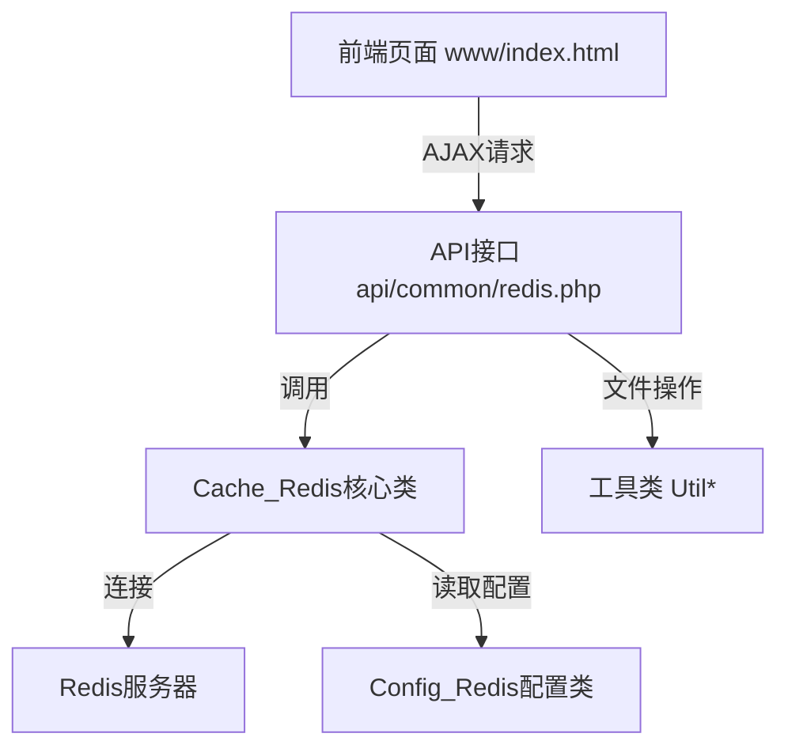
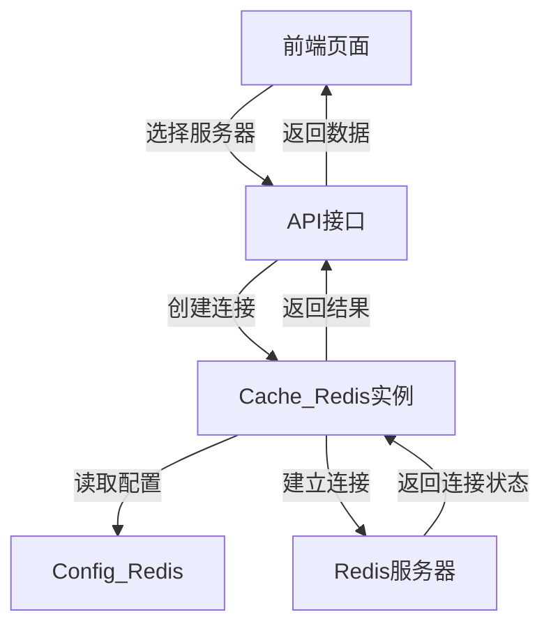
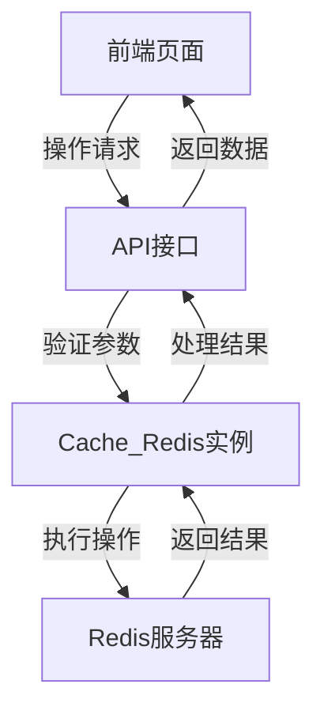

# Redis 小助手 代码 Wiki

## 1. 项目概述

Redis 小助手 是一个符合中国开发者思维方式的在线Redis管理工具框架，设计初衷是快捷、简单、实用。

- **前端技术栈**：Vuejs、iView框架
- **后端技术栈**：PHP、PhpRedis扩展、PhpSpreadsheet框架
- **核心依赖**：betterlife框架、betterlife.front框架

## 2. 项目架构

### 2.1 目录结构

```
├── api/             # AJAX请求服务端支持
│   └── common/      # 通用API接口
├── core/            # 框架核心支持文件
│   ├── cache/       # 缓存相关实现
│   ├── config/      # 配置文件
│   ├── exception/   # 异常处理
│   ├── include/     # 常用函数库
│   ├── lang/        # 语言文件
│   ├── log/         # 日志处理
│   ├── main/        # 核心应用
│   └── util/        # 工具类
├── docs/            # 设计文档
├── help/            # 帮助文档
├── install/         # 安装目录
├── www/             # 前端页面
├── index.php        # 项目入口
├── init.php         # 初始化文件
└── composer.json    # 依赖管理
```

### 2.2 核心模块关系



## 3. 核心模块与功能

### 3.1 缓存模块 (Cache)

#### Cache_Redis 类

**路径**：[core/cache/redis/Cache_Redis.php](file:///Library/WebServer/Documents/redis/core/cache/redis/Cache_Redis.php)

**主要功能**：
- Redis服务器连接与管理
- 键值对的增删改查
- 支持多种Redis数据类型（String、Set、List、ZSet、Hash）
- 数据导入导出

**核心方法**：

| 方法名 | 功能描述 | 参数 | 返回值 |
|--------|----------|------|--------|
| `__construct` | 初始化Redis连接 | host, port, password | 无 |
| `select` | 选择指定数据库 | index | 无 |
| `keys` | 获取所有键值 | pattern | 键值数组 |
| `size` | 获取数据库大小 | 无 | 键数量 |
| `dbInfos` | 获取所有数据库信息 | 无 | 数据库信息数组 |
| `getKeyType` | 获取键类型 | key | 类型代码 |
| `save` | 保存数据（仅当键不存在） | key, value, type, expired | 无 |
| `set` | 保存数据（覆盖已有键） | key, value, type, expired | 无 |
| `update` | 更新数据 | key, value, type, expired | 无 |
| `delete` | 删除键值 | key | 无 |
| `get` | 获取键值 | key | 键值 |
| `gets` | 批量获取键值 | keyArr | 键值数组 |
| `clear` | 清除当前数据库 | 无 | 无 |
| `clearAll` | 清除所有数据库 | 无 | 无 |

### 3.2 配置模块 (Config)

#### Config_Redis 类

**路径**：[core/config/config/cache/Config_Redis.php](file:///Library/WebServer/Documents/redis/core/config/config/cache/Config_Redis.php)

**主要功能**：
- Redis服务器配置管理

**配置参数**：

| 参数名 | 类型 | 默认值 | 描述 |
|--------|------|--------|------|
| `$host` | string | "redis" | Redis服务器地址 |
| `$port` | int | 6379 | Redis服务器端口 |
| `$password` | string | "orm" | Redis服务器密码 |
| `$is_persistent` | bool | false | 是否持久化连接 |
| `$prefix_key` | string | "" | 键前缀 |

### 3.3 API接口模块

#### redis.php

**路径**：[api/common/redis.php](file:///Library/WebServer/Documents/redis/api/common/redis.php)

**主要功能**：
- 处理前端AJAX请求
- 提供Redis操作的API接口
- 服务器配置管理
- 数据导入导出

**API端点**：

| 步骤(step) | 功能描述 | 参数 | 返回值 |
|------------|----------|------|--------|
| 100 | 查询Redis服务器设置列表 | 无 | 服务器列表 |
| 101 | 添加DB | server, port, password | 数据库列表 |
| 102 | 删除DB | server, port, password, db | 数据库列表 |
| 1 | 查询指定服务器所有的DB | server, port, password | 数据库列表 |
| 2 | 查询指定DB所有的keys | server, port, password, db | 键值列表 |
| 3 | 查询指定key的value | server, port, password, db, key | 键值信息 |
| 4 | 修改指定key的value | server, port, password, db, key, val, valType | 修改后的键值 |
| 5 | 模糊查询指定关键词的所有key | server, port, password, db, queryKey | 键值列表 |
| 6 | 新增key和value | server, port, password, db, addNewKey, addNewValue, addNewType | 键值列表 |
| 7 | 删除指定key | server, port, password, db, key | 成功状态 |
| 8 | 导出数据 | server, port, password, db, queryKey | 导出文件URL |
| 9 | 导入数据 | server, port, password, db, ufile | 键值列表 |

## 4. 项目运行与部署

### 4.1 运行环境要求

- PHP 5.3.0 或更高版本
- PhpRedis 扩展
- Redis 服务器
- Web 服务器（Apache/Nginx等）

### 4.2 安装步骤

1. **安装运行环境**：
   - 可选择 WAMP/LAMP/MAMP/XAMPP 等集成环境
   - 或使用宝塔、PhpStudy 等工具

2. **安装 PhpRedis 扩展**：
   - 参考 [install/README.md](file:///Library/WebServer/Documents/redis/install/README.md)

3. **安装依赖**：
   ```bash
   composer install
   ```

4. **设置目录权限**：
   ```bash
   sudo mkdir log/ upload/
   sudo chmod -R 0777 log/ upload/
   ```

5. **访问应用**：
   - 浏览器打开：http://localhost/www/index.html

### 4.3 服务器配置

- **默认配置**：
  - 服务器地址：redis
  - 端口：6379
  - 密码：orm

- **配置持久化**：
  - 在 `www/js/main.js` 中配置 `isConfigLocal`：
    - `isConfigLocal: true`：配置存储在本地浏览器
    - `isConfigLocal: false`：配置存储在服务器

## 5. 核心流程

### 5.1 连接Redis服务器流程



### 5.2 键值操作流程



## 6. 依赖关系

### 6.1 核心依赖

| 依赖 | 版本 | 用途 | 来源 |
|------|------|------|------|
| PHP | >=5.3.0 | 运行环境 | [composer.json](file:///Library/WebServer/Documents/redis/composer.json) |
| PhpSpreadsheet | >=1.16.0 | 数据导入导出 | [composer.json](file:///Library/WebServer/Documents/redis/composer.json) |
| PhpRedis | - | Redis操作扩展 | 外部安装 |
| Vuejs | - | 前端框架 | 前端依赖 |
| iView | - | UI组件库 | 前端依赖 |

### 6.2 内部依赖

| 模块 | 依赖模块 | 用途 |
|------|----------|------|
| Cache_Redis | Config_Redis | 读取Redis配置 |
| Cache_Redis | UtilArray | 数组操作 |
| api/common/redis.php | Cache_Redis | Redis操作 |
| api/common/redis.php | UtilExcel | 数据导入导出 |
| api/common/redis.php | UtilFileSystem | 文件操作 |

## 7. 配置与部署

### 7.1 配置文件

- **Redis配置**：[core/config/config/cache/Config_Redis.php](file:///Library/WebServer/Documents/redis/core/config/config/cache/Config_Redis.php)
- **服务器配置**：存储在 `upload/redis/config/redis.json`

### 7.2 部署方式

1. **本地部署**：
   - 使用集成环境如 WAMP/LAMP/MAMP/XAMPP
   - 或使用 `php -S localhost:8000` 启动本地服务器

2. **生产部署**：
   - 配置 Web 服务器（Apache/Nginx）
   - 确保 PhpRedis 扩展已安装
   - 设置正确的目录权限

## 8. 监控与维护

### 8.1 日志管理

- 日志文件存储在 `log/` 目录
- 每天生成一个调试测试日志文件

### 8.2 常见问题

1. **PhpRedis 扩展未安装**：
   - 参考 [install/README.md](file:///Library/WebServer/Documents/redis/install/README.md) 安装

2. **Redis 连接失败**：
   - 检查 Redis 服务器是否运行
   - 检查配置的服务器地址、端口和密码是否正确
   - 检查 Redis 服务器是否允许远程连接

3. **目录权限问题**：
   - 确保 `log/` 和 `upload/` 目录有写权限

## 9. 开发与扩展

### 9.1 开发工具

- [Visual Studio Code](https://code.visualstudio.com/)
- [Atom](https://atom.io)
- [Sublime](http://www.sublimetext.com)

### 9.2 扩展建议

1. **添加更多Redis命令支持**：
   - 扩展 Cache_Redis 类，添加更多 Redis 命令的封装

2. **增强数据可视化**：
   - 添加 Redis 数据的图表展示
   - 增加数据统计功能

3. **添加集群管理**：
   - 支持 Redis 集群的管理

4. **增强安全性**：
   - 添加用户认证
   - 支持 HTTPS

## 10. 参考资料

- **Betterlife 框架**：https://gitee.com/skygreen2015/betterlife
- **Betterlife.Front 框架**：https://gitee.com/skygreen2015/betterlife.front
- **Redis 官方文档**：https://redis.io
- **PhpRedis 扩展**：https://github.com/phpredis/phpredis
- **PhpSpreadsheet**：https://github.com/PHPOffice/PhpSpreadsheet
