# Redis 小助手 - 用户帮助文档

---

## 一、应用简介

Redis 小助手是一款跨平台的 Redis 可视化管理工具，帮助开发者通过直观的图形界面管理 Redis 服务器、数据库和键值数据。

### 核心功能

| 功能 | 说明 |
|------|------|
| 多服务器管理 | 添加、编辑、删除多个 Redis 服务器配置 |
| 数据库管理 | 切换数据库，新增/删除 DB |
| 键值操作 | 查看、添加、编辑、删除键值 |
| 数据类型 | 支持 String、List、Set、ZSet、Hash 五种类型 |
| 搜索 | 按模式搜索键（支持 `*` 通配符） |
| 排序 | 按键名升序或降序排列 |
| 多选删除 | 批量选择键并删除废键箱 |
| 废键箱 | 已删除键的临时存储，支持恢复（7天自动清理） |
| 导入导出 | JSON 格式批量导入导出数据 |
| 多窗口多标签 | 支持多标签页浏览和多窗口，每个标签拥有独立会话 |
| Redis 内存分析 | 内存使用仪表盘、键类型分布统计、大键排行榜 |
| Redis 监控面板 | 服务器信息、内存状态、键统计等实时数据 |
| Redis 慢日志 | 慢查询日志查看，帮助定位性能瓶颈 |
| 操作审计日志 | 记录所有键值读写操作，支持筛选、分页、统计分析 |
| 服务器配置导入导出 | JSON 格式批量导入导出服务器连接配置 |

### 支持平台

- macOS
- Windows
- Web 浏览器（通过 WebSocket 代理）

---

## 二、快速上手

### 2.1 安装与启动

1. 下载对应平台的安装包
2. 安装并启动应用
3. 首次使用需要添加 Redis 服务器连接

### 2.2 添加服务器连接

1. 点击顶部菜单栏 **「连接 ▼」** → **「设置」**
2. 在服务器配置页面点击 **「添加服务器」**
3. 填写服务器信息：
   - **标识**：唯一标识符（如 `dev`、`prod`）
   - **名称**：显示名称（如 `开发服务器`）
   - **主机**：Redis 服务器地址（如 `127.0.0.1`）
   - **端口**：Redis 端口号（默认 `6379`）
   - **密码**：Redis 密码（如有）
   - **默认DB**：默认连接的数据库编号
4. 点击 **「测试连接」** 确认连接成功
5. 点击 **「确定」** 保存

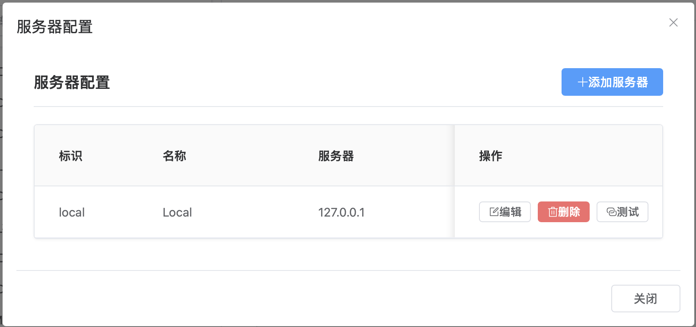

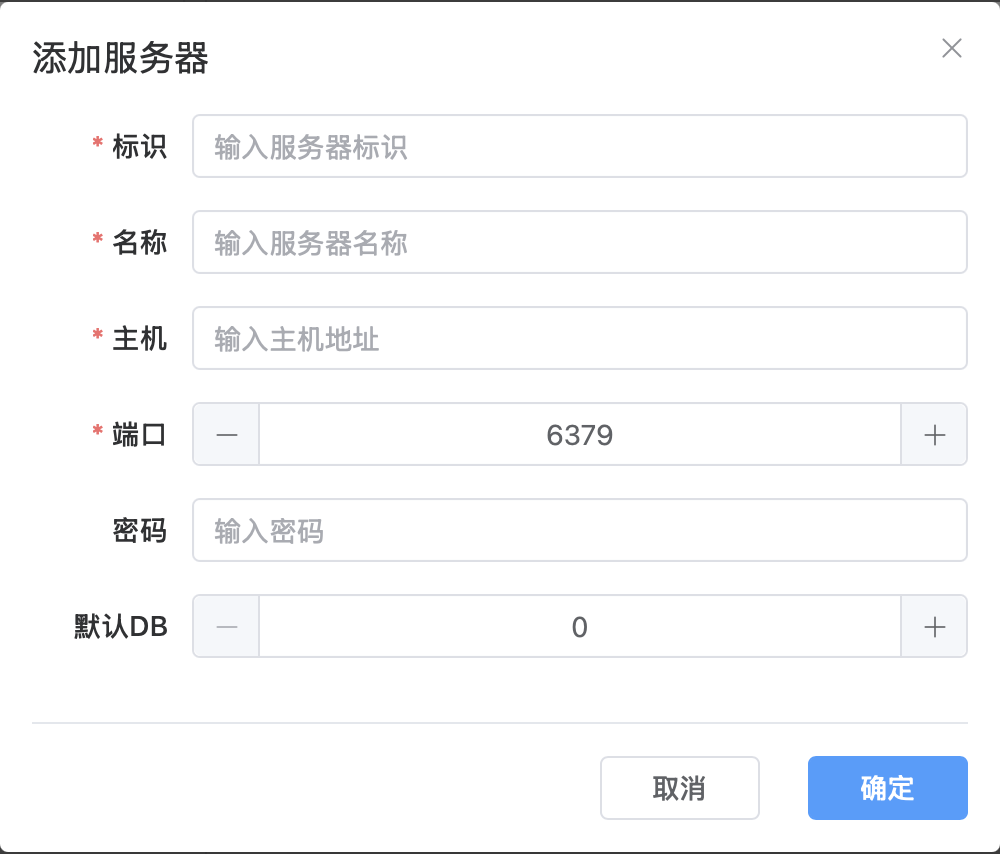

### 2.3 连接服务器并选择数据库

1. 点击菜单栏 **「连接 ▼」** 选择已配置的服务器
2. 点击 **「DB ▼」** 选择要操作的数据库
3. 左侧键列表会自动加载该数据库中的所有键

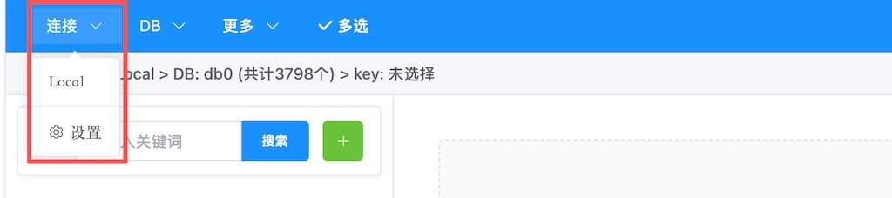

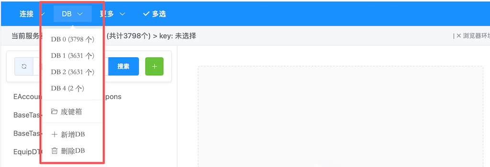

---

## 三、主界面介绍

### 3.1 界面总览

应用界面分为以下几个区域：

- **菜单栏**（顶部）：服务器连接、数据库选择、更多操作、多选模式
- **状态栏**：显示当前路径（服务器 > DB > 键名）
- **左侧键列表区**（35%）：展示所有键，支持搜索和多选
- **右侧值展示区**（65%）：显示选中键的详细内容

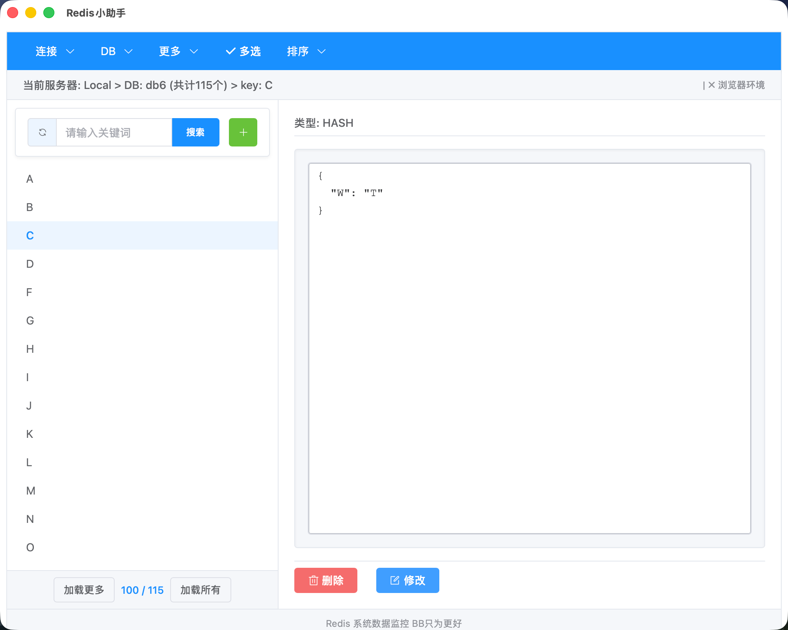

### 3.2 菜单栏

菜单栏包含四个功能入口，紧凑排列：

| 菜单项 | 功能 |
|--------|------|
| **连接 ▼** | 切换服务器、进入服务器设置 |
| **DB ▼** | 切换数据库、进入废键箱、新增/删除 DB |
| **更多 ▼** | 导入数据、导出数据、清空数据库 |
| **排序 ▼** | 按键名升序或降序排列 |
| **多选** | 切换多选删除模式 |
| **内存分析** | 查看内存使用、键类型分布、大键排行 |
| **慢日志** | 查看慢查询日志 |
| **操作审计** | 查看操作审计日志和统计分析 |

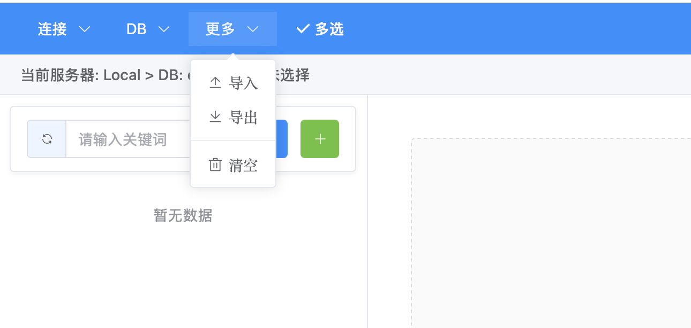

### 3.3 搜索栏

搜索栏位于键列表区顶部，包含以下元素：

| 元素 | 功能 |
|------|------|
| 🔄 | 刷新键列表 |
| 搜索框 | 输入关键词搜索键 |
| 搜索 | 执行搜索 |
| **+** | 添加新键 |

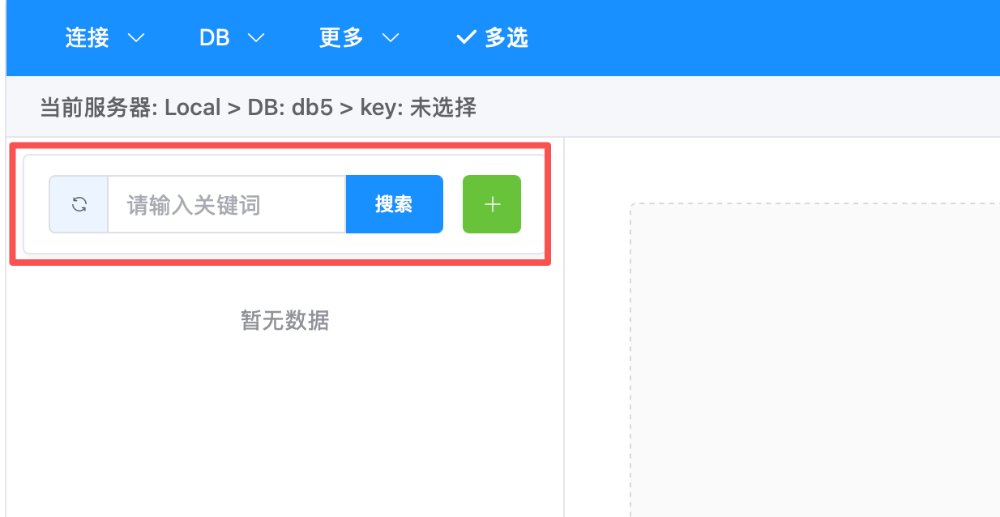

### 3.4 状态栏

状态栏显示当前操作路径，格式为：

```
当前服务器: 服务器名 > DB: db编号 (共计N个) > key: 键名
```

### 3.5 标签栏

应用支持多标签页浏览，每个标签拥有独立的 Redis 连接会话：

| 操作 | 方式 |
|------|------|
| 新建标签 | 点击标签栏右侧 **「+」** 按钮，或按 `Ctrl + T` |
| 切换标签 | 点击标签栏中的标签 |
| 关闭标签 | 点击标签上的 **「×」** 按钮，或按 `Ctrl + W` |
| 关闭窗口 | 按 `Ctrl + Shift + W` |

新建标签时会弹出服务器选择对话框，选择服务器后自动创建新会话。

---

## 四、键值管理

### 4.1 浏览键列表

左侧键列表展示当前数据库中的所有键。首次加载显示前 100 个键，可通过底部的按钮加载更多：

| 按钮 | 功能 |
|------|------|
| **加载更多** | 再加载 100 个键 |
| **N / M** | 已加载数量 / 总数量 |
| **加载所有** | 一次性加载全部键 |

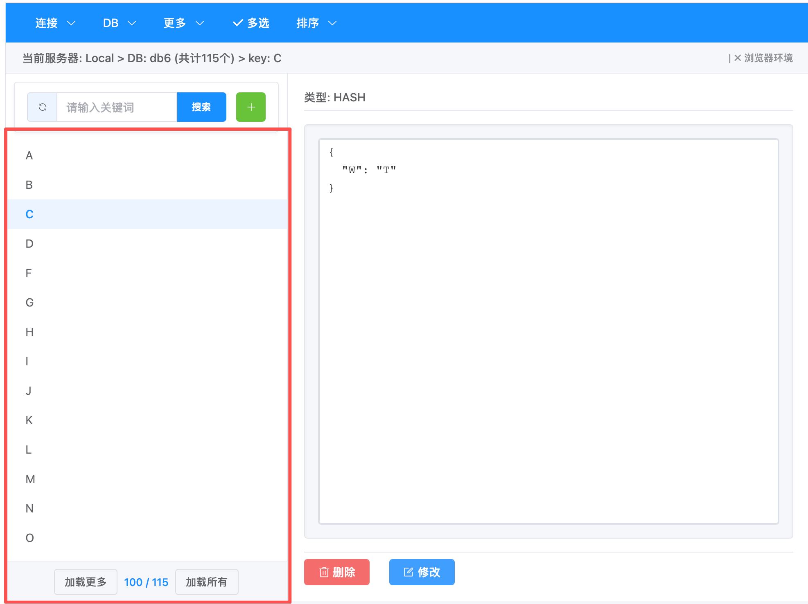

### 4.2 排序键列表

点击菜单栏的 **「排序 ▼」**，可对键列表进行排序：

| 选项 | 功能 |
|------|------|
| **升序 A→Z** | 按键名字母升序排列 |
| **降序 Z→A** | 按键名字母降序排列 |

- 再次点击已选中的排序方式可**取消排序**，恢复原始顺序
- 排序为纯前端操作，不影响 Redis 中的数据顺序

### 4.3 搜索键

1. 在搜索框中输入关键词
2. 点击 **「搜索」** 按钮或按 `Enter` 键
3. 系统自动添加 `*` 通配符进行模糊匹配
4. 点击搜索栏的 🔄 按钮可清除搜索并刷新列表

**搜索示例**：
- 输入 `user` → 匹配 `user:1001`、`user:1002`、`user_profile`
- 输入 `cache:*` → 匹配 `cache:session`、`cache:data`

### 4.4 查看键值

在键列表中点击任意键，右侧值展示区会显示该键的详细内容。

#### STRING 类型

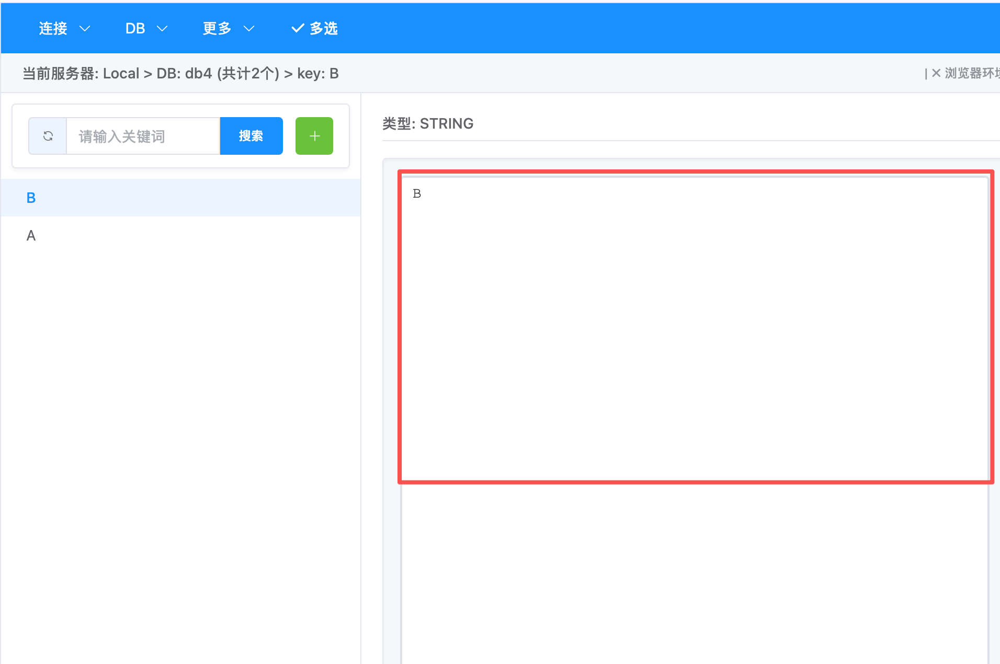

纯文本展示，可直接在编辑器中查看和修改。

#### HASH 类型

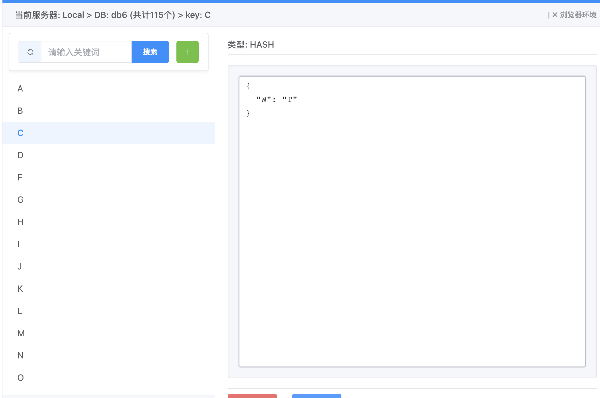

以 JSON 格式展示键值对，例如：

```json
{
  "name": "张三",
  "age": "25",
  "phone": "13800138000"
}
```

#### LIST / SET / ZSET 类型

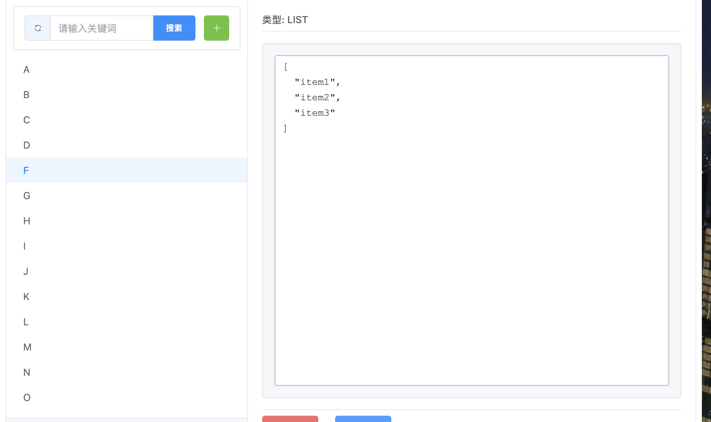

均以 JSON 数组格式展示：

- **LIST**：`["item1", "item2", "item3"]`
- **SET**：`["member1", "member2", "member3"]`
- **ZSET**：`[["player1", 100], ["player2", 80]]`

### 4.5 添加键

1. 点击搜索栏右侧的 **「+」** 按钮
2. 在添加键对话框中填写：
   - **键名**：要创建的键名称
   - **类型**：选择数据类型（String / List / Set / ZSet / Hash）
   - **值**：输入对应的值内容
3. 点击 **「确定」** 创建

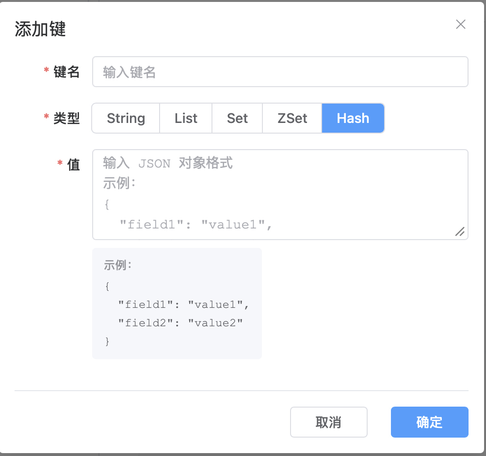

**各类型的值格式**：

| 类型 | 值格式 | 示例 |
|------|--------|------|
| String | 纯文本 | `Hello World` |
| List | JSON 数组 | `["任务1", "任务2", "任务3"]` |
| Set | JSON 数组 | `["标签1", "标签2", "标签3"]` |
| ZSet | JSON 数组 | `[["玩家1", 100]]` |
| Hash | JSON 对象 | `{"name":"张三","age":"25"}` |

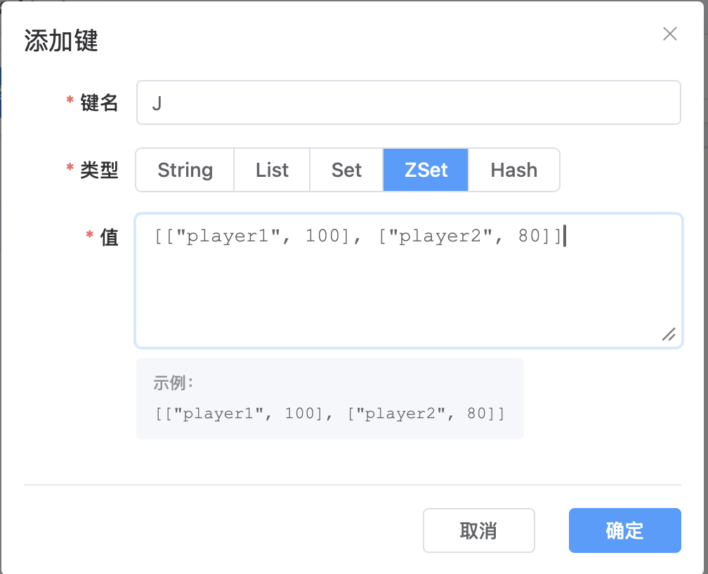

### 4.6 编辑键值

1. 在键列表中点击要修改的键
2. 在右侧值展示区的编辑器中修改内容
3. 点击 **「修改」** 按钮保存

### 4.7 删除键

1. 在键列表中点击要删除的键
2. 点击右侧值展示区的 **「删除」** 按钮
3. 确认后键将被删除废键箱（7天后自动清理）

---

## 五、多选删除

### 5.1 进入多选模式

点击菜单栏的 **「多选」** 按钮，进入多选模式：
- 键列表会显示复选框
- 键列表上方展开多选操作面板

### 5.2 选择键

在多选模式下，勾选需要删除的键。选中数量会实时显示在操作面板中。

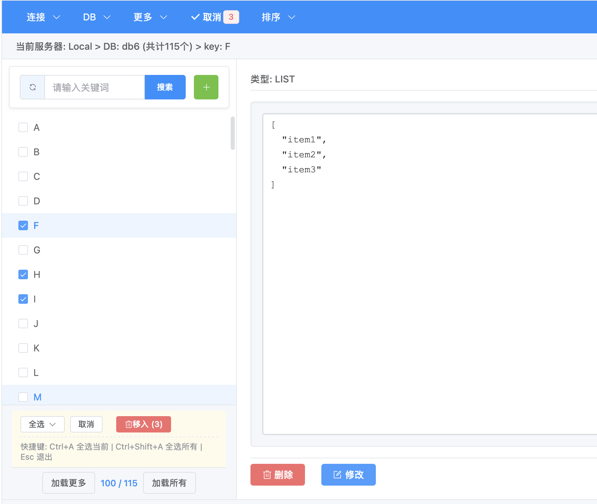

### 5.3 全选操作

点击操作面板中的 **「全选 ▼」** 按钮，可选择：

| 选项 | 说明 |
|------|------|
| **全选当前已加载** | 选中当前已加载到列表中的所有键 |
| **全选所有** | 先加载全部键，然后全部选中 |

### 5.4 删除废键箱

1. 勾选需要删除的键
2. 点击操作面板中的 **「删除 (N)」** 按钮（N 为选中数量）
3. 在确认对话框中点击 **「确认」**
4. 选中的键将被删除废键箱

### 5.5 快捷键

多选模式下可使用以下快捷键：

| 快捷键 | 功能 |
|--------|------|
| `Ctrl + A` | 全选当前已加载的键 |
| `Ctrl + Shift + A` | 全选所有键（先加载全部） |
| `Esc` | 退出多选模式 |

---

## 六、废键箱

### 6.1 进入废键箱

点击菜单栏 **「DB ▼」** → **「废键箱」**，进入废键箱页面。

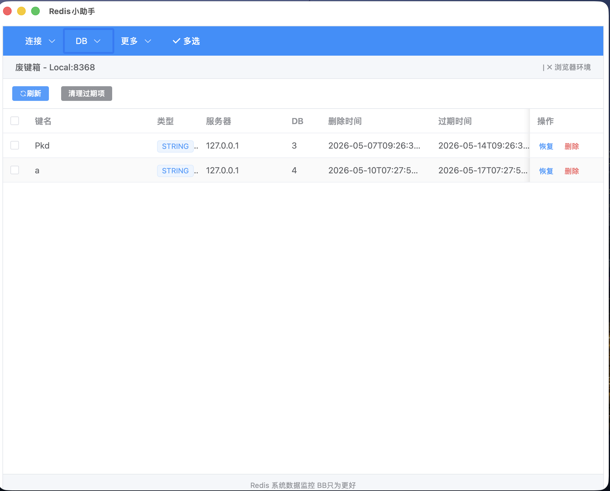

### 6.2 恢复键

1. 在废键箱列表中勾选需要恢复的键
2. 点击工具栏的 **「恢复选中」** 按钮
3. 键将恢复到原来的服务器和数据库中

也可以点击单行的 **「恢复」** 按钮恢复单个键。

### 6.3 永久删除

1. 在废键箱列表中勾选需要永久删除的键
2. 点击工具栏的 **「永久删除选中」** 按钮
3. 确认后键将被彻底删除，无法恢复

也可以点击单行的 **「永久删除」** 按钮。

### 6.4 清理过期项

点击工具栏的 **「清理过期项」** 按钮，可手动清理已过期的废键项。

### 6.5 自动清理机制

- 废键箱中的键默认保留 **7 天**
- 7 天后自动清理，无法恢复
- 每次打开废键箱时会自动检查并清理过期项

---

## 七、数据导入导出

### 7.1 导出数据

1. 点击菜单栏 **「更多 ▼」** → **「导出」**
2. 选择保存位置和文件名
3. 数据将以 JSON 格式导出

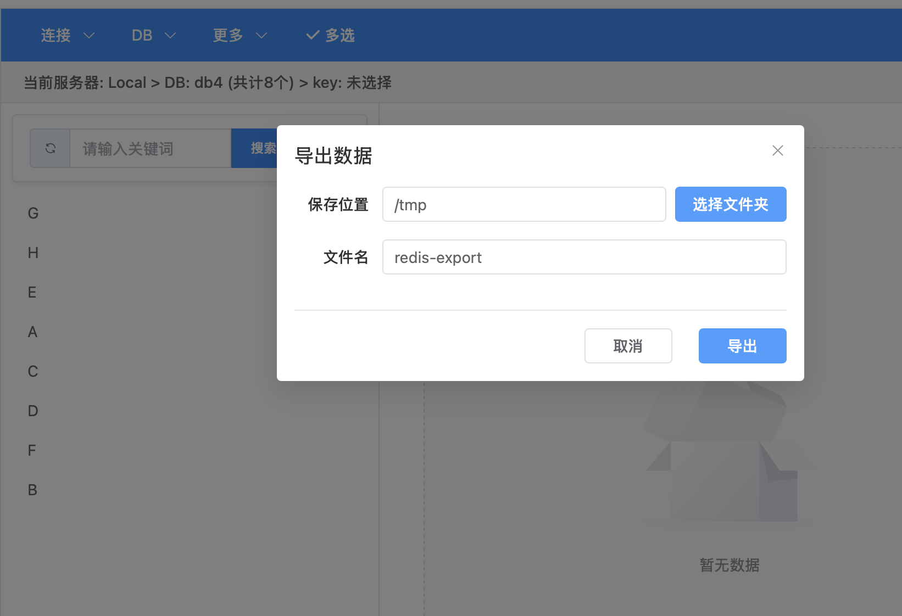

**导出格式**：

```json
[
  {"key": "user:1001", "value": "{\"name\":\"张三\"}", "type": "hash"},
  {"key": "greeting", "value": "Hello World", "type": "string"}
]
```

### 7.2 导入数据

1. 点击菜单栏 **「更多 ▼」** → **「导入」**
2. 选择要导入的 JSON 文件
3. 数据将批量写入当前数据库

### 7.3 清空数据库

1. 点击菜单栏 **「更多 ▼」** → **「清空」**
2. 确认后当前数据库的所有键将被删除
3. 被删除的键**不会**删除废键箱，请谨慎操作

---

## 八、Redis 内存分析

### 8.1 打开内存分析

1. 点击菜单栏 **「更多 ▼」** → **「内存分析」**
2. 系统将扫描当前数据库的内存使用情况

### 8.2 查看分析结果

内存分析对话框包含以下内容：

| 区域 | 说明 |
|------|------|
| 内存仪表盘 | 显示总内存、已用内存、碎片率 |
| 键类型分布 | 展示各数据类型键的数量占比 |
| 大键排行榜 | 列出内存占用最大的键（支持分页加载） |

### 8.3 注意事项

- 内存分析需要对每个键执行 `MEMORY USAGE` 命令，键数量较多时可能耗时较长
- 建议在非高峰期执行全量内存分析

## 九、Redis 慢日志

### 9.1 打开慢日志

1. 点击菜单栏 **「更多 ▼」** → **「慢日志」**
2. 系统将获取 Redis 服务器的慢查询日志

### 9.2 查看日志

慢日志对话框展示以下信息：

| 字段 | 说明 |
|------|------|
| 命令 | 执行的 Redis 命令 |
| 执行时间 | 命令执行耗时（微秒） |
| 客户端 | 发起请求的客户端地址 |
| 时间戳 | 命令执行时间 |

### 9.3 搜索与过滤

- 在搜索框中输入关键词可过滤日志
- 系统自动过滤 PING、INFO 等噪音命令

## 十、操作审计日志

### 10.1 打开操作审计

1. 点击菜单栏 **「更多 ▼」** → **「慢日志」**
2. 在日志对话框顶部切换到 **「操作审计」** 标签

### 10.2 查看审计日志

审计日志自动记录所有键值读写操作（GET/SET/DEL），展示以下信息：

| 字段 | 说明 |
|------|------|
| 时间 | 操作执行时间 |
| 命令 | Redis 命令名 |
| 参数 | 命令参数（SET 操作的值内容隐藏显示） |
| 耗时 | 执行耗时（毫秒） |
| 状态 | 成功或失败 |

### 10.3 筛选与搜索

- **关键词搜索**：输入关键词过滤命令或参数
- **命令类型筛选**：从下拉菜单选择特定命令类型
- **时间范围**：选择起止时间范围

### 10.4 统计分析

审计页面顶部展示四张统计卡片：

| 卡片 | 说明 |
|------|------|
| 总命令数 | 所有操作的调用次数 |
| 平均响应时间 | 加权平均执行耗时 |
| 成功率 | 成功操作占比 |
| 最慢命令 | 平均耗时最高的命令 |

页面底部展示命令分布条形图，直观显示各命令的调用频率。

### 10.5 分页浏览

审计日志默认每页显示 50 条，可通过底部分页导航浏览历史记录。

### 10.6 其他操作

| 操作 | 说明 |
|------|------|
| 清空日志 | 清除所有审计日志记录 |
| 生成测试数据 | 生成 100 条测试数据用于功能验证 |

### 10.7 存储说明

- 审计日志存储在 Redis 中（key: `redis:audit:logs`），最多保留 1,000,000 条
- SET 操作的值内容不会记录，显示为 `(value hidden)` 以保护敏感数据
- 日志采用固定容量淘汰策略，超出上限后自动丢弃最旧的记录

## 十一、服务器配置导入导出

### 11.1 导出服务器配置

1. 在服务器设置页面（**「连接 ▼」** → **「设置」**）
2. 点击 **「导出配置」** 按钮
3. 选择保存位置，配置将以 JSON 格式导出

### 11.2 导入服务器配置

1. 在服务器设置页面点击 **「导入配置」** 按钮
2. 选择之前导出的 JSON 文件
3. 系统将批量导入服务器配置

> **注意**：导入时会跳过已存在的服务器标识，避免覆盖现有配置。

---

## 十二、数据库管理

### 新增 DB

1. 点击菜单栏 **「DB ▼」** → **「新增DB」**
2. 输入要创建的 DB 编号
3. 确认后自动切换到新 DB

### 删除 DB

1. 点击菜单栏 **「DB ▼」** → **「删除DB」**
2. 选择要删除的 DB（支持多选）
3. 确认后所选 DB 的数据将被清空

### 切换 DB

点击菜单栏 **「DB ▼」**，在列表中选择目标数据库。

---

## 十三、服务器管理

### 13.1 服务器列表

点击 **「连接 ▼」** → **「设置」**，查看所有已配置的服务器。


### 13.2 添加服务器

参见 [2.2 添加服务器连接](#22-添加服务器连接)

### 13.3 编辑服务器

1. 在服务器列表中点击 **「编辑」** 按钮
2. 修改服务器信息（标识不可修改）
3. 点击 **「确定」** 保存

### 13.4 删除服务器

1. 在服务器列表中点击 **「删除」** 按钮
2. 确认后服务器配置将被移除

### 13.5 测试连接

1. 在添加或编辑服务器时，点击 **「测试连接」**
2. 系统会尝试连接 Redis 服务器
3. 显示连接成功或失败的提示

---

## 十四、快捷键一览

| 快捷键 | 功能 | 适用场景 |
|--------|------|----------|
| `Enter` | 执行搜索 | 搜索框聚焦时 |
| `Ctrl + A` | 全选当前已加载的键 | 多选模式 |
| `Ctrl + Shift + A` | 全选所有键 | 多选模式 |
| `Esc` | 退出多选模式 | 多选模式 |
| `Ctrl + T` | 新建标签 | 任意时刻 |
| `Ctrl + W` | 关闭当前标签 | 标签栏存在时 |
| `Ctrl + Shift + W` | 关闭当前窗口 | 任意时刻 |

---

## 十五、常见问题 (FAQ)

### Q: 连接 Redis 服务器失败怎么办？

1. 检查服务器地址和端口是否正确
2. 确认 Redis 服务是否正在运行
3. 检查防火墙设置
4. 确认密码是否正确
5. 使用「测试连接」功能诊断

### Q: 搜索支持什么语法？

搜索支持 `*` 通配符进行模糊匹配。输入的关键词会自动在前后添加 `*`，例如输入 `user` 会匹配 `user:1001`、`my_user` 等。

### Q: 废键箱中的数据能保留多久？

废键箱中的数据默认保留 7 天，到期后自动清理。建议及时恢复需要的数据。

### Q: 删除的键能恢复吗？

通过值展示区的「删除」按钮或「删除废键箱」删除的键可以在废键箱中恢复。但通过「清空数据库」删除的键无法恢复。

### Q: 支持哪些数据类型？

支持 Redis 的五种核心数据类型：String、List、Set、ZSet（有序集合）、Hash。

### Q: 导入导出使用什么格式？

使用 JSON 格式。导出文件格式为 `[{"key":"键名","value":"值","type":"类型"}]`。

### Q: 配置文件存储在哪里？

- 服务器配置：`~/.redis-helper/config.json`
- 废键箱数据：`~/.redis-helper/trash.json`

### Q: 支持在浏览器中使用吗？

支持。通过 WebSocket 代理服务，可以在 Web 浏览器中运行完整功能。运行 `npm run dev` 会自动启动代理服务，访问 `http://localhost:5173` 即可使用。

### Q: 内存分析功能对 Redis 性能有影响吗？

内存分析需要对每个键执行 `MEMORY USAGE` 命令。对于键数量较少的数据库（<10,000）影响可忽略；对于键数量很大的数据库，建议在非高峰期执行。

### Q: 多标签之间数据会互相影响吗？

不会。每个标签拥有独立的会话，切换标签不会影响其他标签的数据状态。

### Q: List/Set/ZSet/Hash 类型的值如何输入？

这些复杂类型使用 JSON 格式输入：
- **List**：`["元素1", "元素2"]`
- **Set**：`["成员1", "成员2"]`
- **ZSet**：`[["成员1", 100], ["成员2", 80]]`
- **Hash**：`{"字段1":"值1","字段2":"值2"}`

### Q: 审计日志会占用多少 Redis 内存？

默认最多保留 1,000,000 条记录，每条约 200-500 字节，最大占用约 500MB Redis 内存。可通过"清空日志"按钮释放。

### Q: 审计日志会影响 Redis 性能吗？

每次键值操作会增加一次 LPUSH 写入（<1ms），对正常使用几乎无感知。

---

## 十六、注意事项

1. **废键箱自动清理**：废键箱中的键 7 天后自动清理，请及时恢复需要的数据
2. **清空数据库不可恢复**：通过「更多」→「清空」删除的数据不会进入废键箱
3. **网络权限**：应用需要网络权限以连接 Redis 服务器
4. **数据格式**：List/Set/ZSet/Hash 类型的值使用 JSON 格式存储和展示
5. **分页加载**：键列表采用分页加载机制，首次加载 100 个，可通过「加载所有」加载全部
